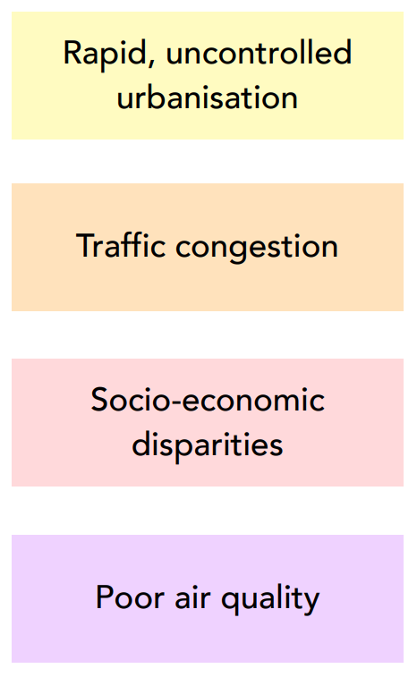
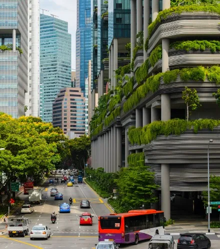

class: align-left
```{r setup, include=FALSE}
options(htmltools.dir.version = FALSE, htmltools.preserve.raw = FALSE)
```
# Table of contents

---
# Bogota: the context 

.pull-left[Once celebrated for the world’s longest cycle route and the innovative Transmilenio system, Bogotá now faces several key challenges, including:

```{r echo=FALSE, out.width= "100%", fig.show='hold', fig.align= 'left'}

knitr::include_graphics('bogota.png')
```
]

.pull-right[
```{r echo=FALSE, out.width= "65%", fig.show='hold', fig.align= 'center'}


```
]
---

# Past interventions
```{r  echo=FALSE, out.width='45%', fig.align='left', cache=FALSE}
knitr::include_graphics("map.png")
```
.pull-left[
(i) Medellin’s implemented Corredor Verde 
- Missed opportunities for continuous monitoring using remote sensing data
- Failed to fully utilise traffic congestion data
- Limited socio-demographic analysis
- Overlooked the urban heat island effect


(ii) Bogotá’s Septima Verde: a rejected proposal
- Rejected due to skepticism of sustainability claims 
- Lack of EO data demonstrating environmental benefits
- No predictive modelling to anticipate traffic impacts
- Insufficient stakeholder engagement
]

---
# International and national compliance

---
# Case study

### Cooling Singapore 2.0 – Digital Urban Climate Twin (DUCT)

.pull-left[
<small>
- Aims to simulate scenarios in regions experiencing elevated temperatures, which may involve the incorporation of additional parks and open spaces.
- A beta version of DUCT was released for testing by urban planners and policy makers.
- Integrates all pertinent computational models to consider environmental variables such as wind and sunlight, land cover, traffic, industrial and building energy models, and human mobility + allows for the simulation of various scenarios.
- Target is to achieve Technology Readiness Level 6+ by August 2024.

Sources: World Bank, 2023; Ang, 2024; Aydt, 2023.</small>]

.pull-right[
```{r echo=FALSE, out.width= "95%", fig.show='hold', fig.align= 'center'}


```
]

---
# Workflow: simulation

DISCUSS HOW DATA + WORKFLOW CAN BE INCORPORATED INTO THE CITY'S 'BUSINESS AS USUAL' DATA PIPELINES/WORKFLOWS

---
# Workflow: site selection

PROPOSE TIMELINE FOR PLAN

---
# Data inputs

PROPOSE ESTIMATED SPENDING PLAN

---
# Integration to Bogota's pipeline

PROPOSE OPPORTUNITIES FOR STAKEHOLDER ENGAGEMENT W/ PROJECT

---
# Stakeholder engagement 1
```{r echo=FALSE, out.width= "10%", fig.show='hold', fig.align= 'left'}


```
<small>
- District Planning Secretariat (Secretaría Distrital de Planeación)
- Environmental Secretariat (Secretaría Distrital de Ambiente)
- Mobility Secretariat (Secretaría de Movilidad)
- Department of Public Works (IDU - Instituto de Desarrollo Urbano)


```{r echo=FALSE, out.width= "10%", fig.show='hold', fig.align= 'left'}


```
- Local Community Action Boards (Juntas de Acción Comunal)
- Bogotá Como Vamos
- Fundación Al Verde Vivo


```{r echo=FALSE, out.width= "10%", fig.show='hold', fig.align= 'left'}


```
- Universidad de los Andes
- Universidad Nacional de Colombia
- Javeriana University
</small>
---
#Stakeholder engagement 2
```{r echo=FALSE, out.width= "10%", fig.show='hold', fig.align= 'left'}


```
- Bogotá Chamber of Commerce (Cámara de Comercio de Bogotá):
- Fenalco Bogotá


```{r echo=FALSE, out.width= "10%", fig.show='hold', fig.align= 'left'}


```
- Transportation Unions
- Residents of Affected Neighborhoods


```{r echo=FALSE, out.width= "10%", fig.show='hold', fig.align= 'left'}


```
- Environmental Activist Groups
- World Bank Urban Development Sector
- C40 Cities Climate Leadership Group

---
# GANTT and team details

---
# Limitations and mitigation of risk

---
# Future continuation

---