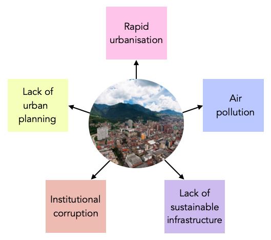

class: align-left
```{r setup, include=FALSE}
options(htmltools.dir.version = FALSE, htmltools.preserve.raw = FALSE)
```
## Bogotá: the problems
```{r echo=FALSE, out.width = "80%", fig.align='center', cache=FALSE}

```


---
## Improving compliance with development agendas

PROVIDE DESCRIPTION OF HOW IMPROVING BOGOTÁ'S ISSUES WOULD IMPROVE COMPLIANCE WITH DEVELOPMENT AGENDAS

---
## Benefits of change

SHOW THE BENEFITS THAT IMPROVING THE ISSUE WOULD BRING TO THE CITY + POPULATION

---
## Who we are + our role

EXPLAIN HOW GIVEN THE PROBLEM AND THE PROJECT WE COME INTO THINGS - EMPHASIS ON THE FACT THAT WE'RE MONITORING FOR THE SAKE OF COMPLIANCE

---
## Proposed workflow

OFFER A LOGICAL workflow that incorporates EO data (at least one dataset required)

---
## Incorporating workflow into Bogotá's 'business as usual'

DISCUSS HOW DATA + WORKFLOW CAN BE INCORPORATED INTO THE CITY'S 'BUSINESS AS USUAL' DATA PIPELINES/WORKFLOWS

---
## Project management overview (1): Timeline

PROPOSE TIMELINE FOR PLAN

---
## Project management overview (2): Estimated spending plan

PROPOSE ESTIMATED SPENDING PLAN

---
## Project management overview (3): Dates of key deliverables 

PROPOSE DATES FOR KEY DELIVERABLES (GANTT CHART)

---
## Project management overview (4): Stakeholder engagement opportunities

PROPOSE OPPORTUNITIES FOR STAKEHOLDER ENGAGEMENT W/ PROJECT

---
## End slide

---
## References 
