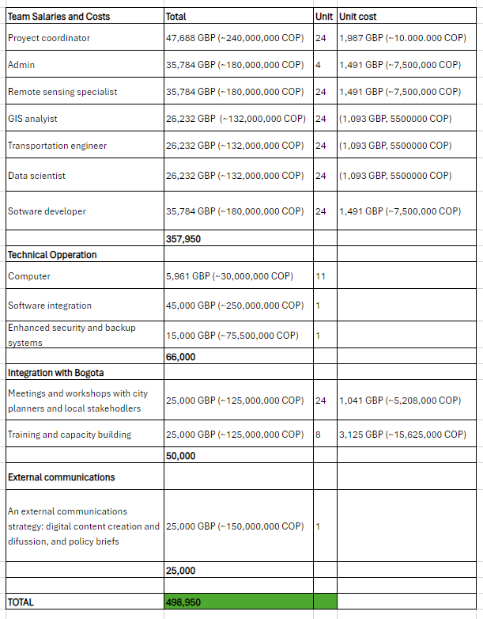
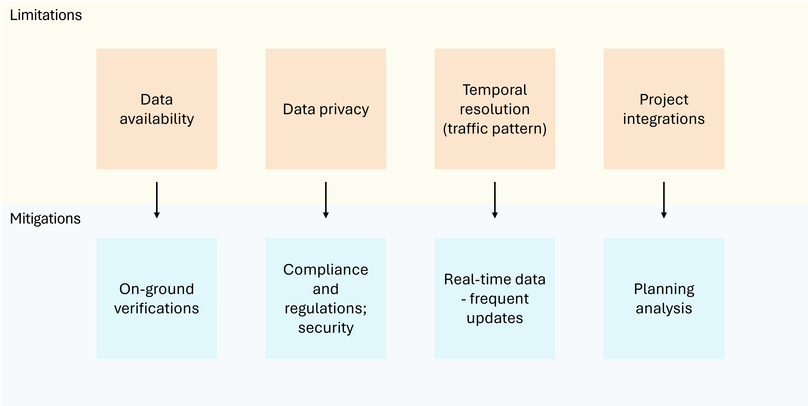

```{r setup, include=FALSE,echo=FALSE}
options(htmltools.dir.version = FALSE)
library(dplyr)
library(readr)
library(readxl)
library(knitr)
```

```{r xaringan-themer, include=FALSE, warning=FALSE}
library(xaringanthemer)
style_duo_accent(primary_color = "#0D5E74", 
                 # secondary_color = "#2881C6",
  header_font_google = google_font("Helvetica"),
  text_font_google   = google_font("Helvetica", "300", "300i"),
  code_font_google   = google_font("Helvetica"),
)
```

```{r xaringan-all, echo=FALSE, warning=FALSE}
library(countdown)
library(xaringan)
library(xaringanExtra)
hook_source <- knitr::knit_hooks$get('source')
knitr::knit_hooks$set(source = function(x, options) {
  x <- stringr::str_replace(x, "^[[:blank:]]?([^*].+?)[[:blank:]]*#<<[[:blank:]]*$", "*\\1")
  hook_source(x, options)
})
xaringanExtra::use_broadcast()
xaringanExtra::use_freezeframe()
xaringanExtra::use_scribble()
#xaringanExtra::use_slide_tone()
xaringanExtra::use_search(show_icon = TRUE, auto_search	=FALSE)
xaringanExtra::use_freezeframe()
xaringanExtra::use_clipboard()
xaringanExtra::use_tile_view()
xaringanExtra::use_panelset()
xaringanExtra::use_editable(expires = 1)
xaringanExtra::use_fit_screen()
xaringanExtra::use_extra_styles(
  hover_code_line = TRUE,         
  mute_unhighlighted_code = TRUE  
)
```

class: center, title-slide, middle

background-image: url("bogotathings1.jpeg")
background-size: cover
background-position: center

# Green Corridor in Bogotá
## CASA0023 Remotely Sensing Cities and Environments
### <br/>Ana Steiner, Aida Kazlauskaitė,<br/> Ciara Clarke, Marta Woroniecka and Hannah Schuller<br/>  `r format(Sys.time(), "%d/%m/%Y")`

---

## Table of contents

1. Bogota: the context
2. Past interventions
3. International and national compliance
4. Case study
5. Workflow: Simulation
6. Workflow: Site selection
7. Data inputs
8. Integration to Bogota's pipeline
9. Stakeholder engagement
10. Team roles and purposes
11. GANTT graph
12. Budget 
13. Limitations and mitigation of risk
14. Future continuation

---
## Bogota: the context 

.pull-left[Once celebrated for the world’s longest cycle route and the innovative Transmilenio system, Bogotá now faces several key challenges, including:

```{r echo=FALSE, out.width= "100%", fig.show='hold', fig.align= 'left'}

knitr::include_graphics('bogota.png')
```
]

.pull-right[
```{r echo=FALSE, out.width= "65%", fig.show='hold', fig.align= 'center'}

knitr::include_graphics('context.png')
```
]
---

## Past interventions
.pull-left[
```{r  echo=FALSE, out.width='90%', fig.align='left', cache=FALSE}
knitr::include_graphics("map.png")
```
]

.pull-right[ 
##### (i) Medellin’s implemented Corredor Verde 
- Missed opportunities for continuous monitoring using remote sensing data
- Failed to fully utilise traffic congestion data
- Limited socio-demographic analysis
- Overlooked the urban heat island effect

##### (ii) Bogotá’s rejected Septima Verde
- Rejected due to skepticism of sustainability claims 
- Lack of EO data demonstrating environmental benefits
- No predictive modelling to anticipate traffic impacts
]

---
## International and national compliance

```{r echo=FALSE, out.width= "90%", fig.show='hold', fig.align= 'centre'}

knitr::include_graphics('compliance.png')
```

---
## Proposal

#### Main Objective:
- Develop a simulator using land surface temperature data and traffic data to identify optimal locations for a green corridor in Bogota.
- Account for how this will affect city-wide traffic flow and heat patterns before implementation.

#### Secondary Objectives:
- Transform key streets and corridors to prioritize greenery, public spaces, and pedestrian access. 
- Improve air quality by decreasing traffic congestion.

#### Outputs:
- A comprehensive simulator tool for planning green corridors.
- Capacity building programs for stakeholders to leverage the simulator in urban planning.
- A detailed proposal for the green corridor's location and design based on simulator outcomes.

---
## Case study

---
```{r echo=FALSE, out.width= "180%", fig.show='hold', fig.align= 'centre'}

knitr::include_graphics('simulator_workflow.png')
```

---
```{r echo=FALSE, out.width= "90%", fig.show='hold', fig.align= 'centre'}

knitr::include_graphics('project_workflow.png')
```

---
## Data inputs
.panelset[
.panel[.panel-name[Traffic]

```{r, echo=FALSE, message= FALSE, warning=FALSE}
library(readxl)
traffic <- read_excel('traffic.xlsx')
library(tidyverse) 
```

```{r, echo=FALSE}
knitr::kable(head(traffic), format = 'html')
```
]

.panel[.panel-name[Land surface temperature]
```{r, echo=FALSE, message= FALSE, warning=FALSE}
library(readxl)
LST <- read_excel('LST.xlsx')
library(tidyverse) 
```

```{r, echo=FALSE}
knitr::kable(head(LST), format = 'html')
```
]

.panel[.panel-name[Socio-demographic]
```{r, echo=FALSE, message= FALSE, warning=FALSE}
library(readxl)
sociodemographic <- read_excel('sociodemographic.xlsx')
library(tidyverse) 
```

```{r, echo=FALSE}
knitr::kable(head(sociodemographic), format = 'html')
```
]
]

---

## Integration to Bogota's pipeline

---

## Stakeholder engagement

---

## Team roles and purpuses

| Team                    | Role/Purpose                                                                                                            |
|-------------------------|-------------------------------------------------------------------------------------------------------------------------|
| Project coordinator     | Oversee all project activities, ensuring milestones are met and align with the project's objectives and stakeholder expectations. |
| Admin                   | Provide logistical, administrative, and operational support to ensure smooth project execution.                         |
| Remote sensing specialist | Expertise in acquiring and processing high-resolution optical imagery, NDVI, thermal infrared imagery, and air quality sensor data. Skilled in the use of software for satellite image classification, such as SVM (Support Vector Machines). |
| GIS analyst             | Proficient in GIS software to integrate various data layers, perform spatial analysis, and produce maps and visualizations. Experience with land cover classification and regression analysis to assess relationships between land cover changes and temperature (LST data). |
| Transportation engineer | Skilled in transport modeling and simulation, ideally with experience using SUMO (Simulation of Urban Mobility) or similar tools. Able to import and adjust road network data from sources like OpenStreetMap and calibrate models to reflect real-world conditions. |
| Data scientist          | Capable of managing and analyzing large datasets, including journey origin-destination matrices and traffic flow data. Competent in statistical modeling, machine learning, and data visualization. |
| Software developer      | To support the integration of simulation tools with GIS software, database systems, and potentially develop custom solutions for data analysis and visualization. |

---
## GANNT GRAPH


---
## Budget


---
## Limitations and mitigation of risk

```{r echo=FALSE, out.width= "90%", fig.show='hold', fig.align= 'centre'}


```


---
## Future continuation
- Retain use of the mapping tool for future green space implementations or road traffic adjustments
- Trained team of geo data analysts for tool implementation and future development
- Future iterations could predict other factors such as air quality by incorporating more data on building and vegetation height, meteorological data on wind speed and direction, and air quality recordings.

```{r echo=FALSE, out.width= "50%", fig.show='hold', fig.align= 'center', fig.cap= "Bogota Air Quality (Source: Breezometer, 2024)"}

knitr::include_graphics('airqualitymap.png')
```

---
## References