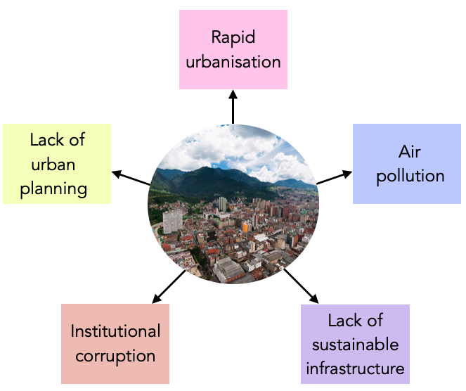
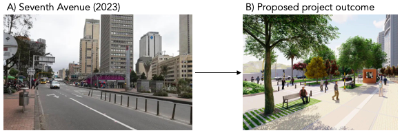
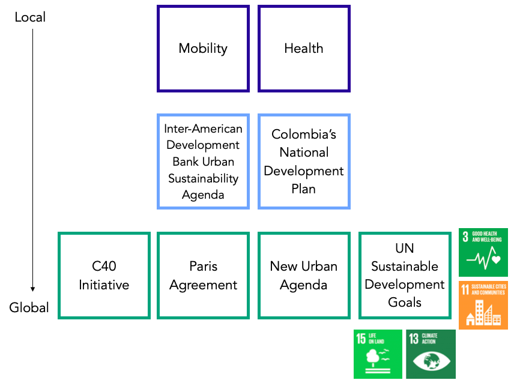
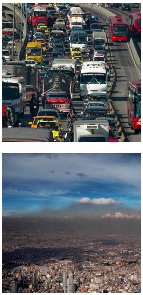

class: align-left
```{r setup, include=FALSE}
options(htmltools.dir.version = FALSE, htmltools.preserve.raw = FALSE)
```
## Bogotá: the problems
```{r echo=FALSE, out.width = "80%", fig.align='center', cache=FALSE}

```

---
## Septima Verde 
This project proposes a 'green corridor' along one of the largest and busiest avenues in Bogotá. It seeks to use the current sidewalk, 4 vehicle lanes as well as currently vacant lots and dwellings.
.pull-left[
#### Objectives:
- Transform streets into pedestrian-friendly spaces
- Encourage use of non-motorised transportation (walking/cycling)
- Reduce car lanes
- Combat air pollution
]

.pull-right[
#### Key components:
- Urban planning
- Cycling infrastructure
- Public transportation integration
- Green spaces
- Accessibility
]
```{r echo=FALSE, out.width = "80%", fig.align='center', cache=FALSE}

```

---
## Project benefits and international compliance
```{r echo=FALSE, out.width = "90%", fig.align='center', cache=FALSE}

```

---
## Our role
.pull-left[
EXPLAIN HOW GIVEN THE PROBLEM AND THE PROJECT WE COME INTO THINGS - EMPHASIS ON THE FACT THAT WE'RE MONITORING FOR THE SAKE OF COMPLIANCE

Specifically, our role will see monitoring two things to ensure project compliance:

a) Traffic congestion

b) Air quality
]
```{r echo=FALSE, out.width = "30%", fig.align='right', cache=FALSE}

```


---
## Proposed workflow

OFFER A LOGICAL workflow that incorporates EO data (at least one dataset required)

---
## Incorporating workflow into Bogotá's 'business as usual'

DISCUSS HOW DATA + WORKFLOW CAN BE INCORPORATED INTO THE CITY'S 'BUSINESS AS USUAL' DATA PIPELINES/WORKFLOWS

---
## Project management overview (1): Timeline

PROPOSE TIMELINE FOR PLAN

---
## Project management overview (2): Estimated spending plan

PROPOSE ESTIMATED SPENDING PLAN

---
## Project management overview (3): Stakeholder engagement opportunities

PROPOSE OPPORTUNITIES FOR STAKEHOLDER ENGAGEMENT W/ PROJECT

---
## End slide

---
## References 
