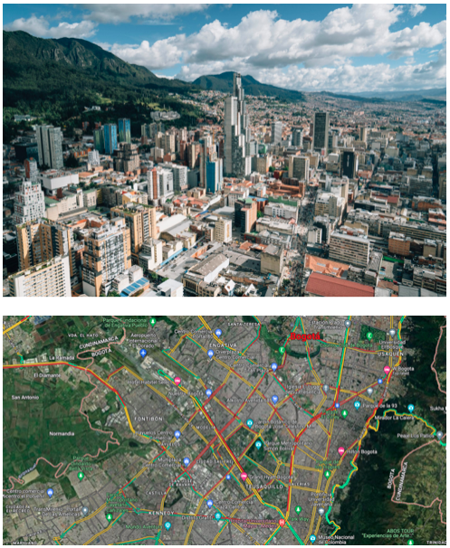
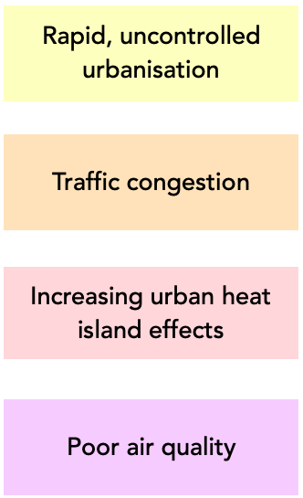
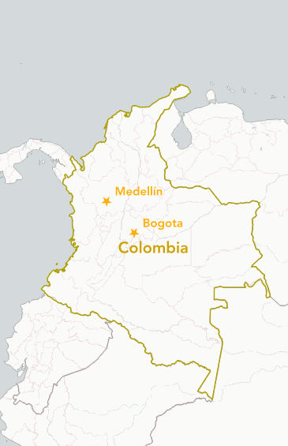
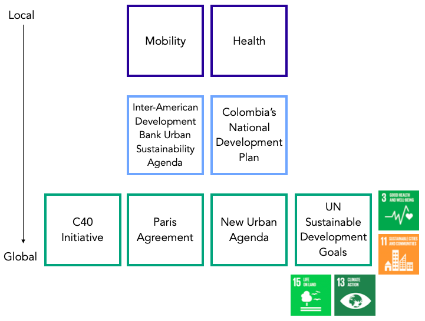
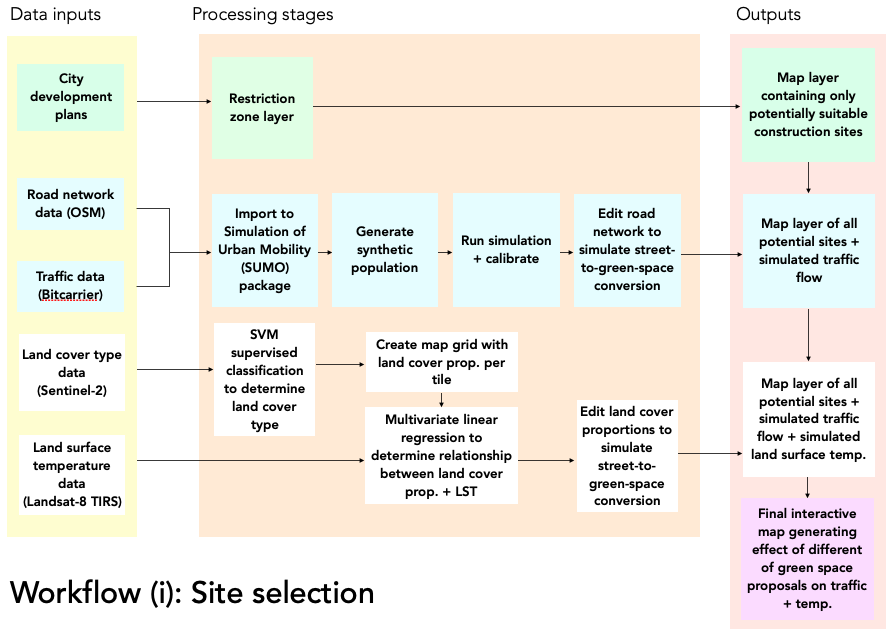
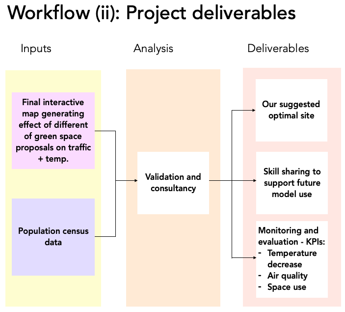
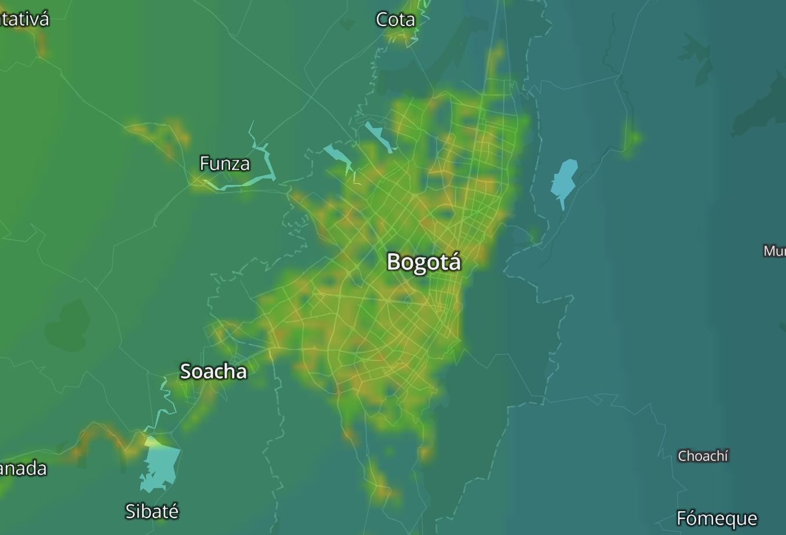

class: align-left
```{r setup, include=FALSE}
options(htmltools.dir.version = FALSE, htmltools.preserve.raw = FALSE)
library(xaringanExtra)
use_panelset()
```
## Table of contents

1. Bogota: the context
2. Past interventions
3. International and national compliance
4. Case study
5. Workflow: Simulation
6. Workflow: Site selection
7. Data inputs
8. Integration to Bogota's pipeline
9. Stakeholder engagement
10. GANTT graph and team details
11. Limitations and mitigation of risk
12. Future continuation

---
## Bogota: the context 

.pull-left[Once celebrated for the world’s longest cycle route and the innovative Transmilenio system, Bogotá now faces several key challenges, including:

```{r echo=FALSE, out.width= "100%", fig.show='hold', fig.align= 'left'}


```
]

.pull-right[
```{r echo=FALSE, out.width= "65%", fig.show='hold', fig.align= 'center'}


```
]
---

## Past interventions
.pull-left[
```{r  echo=FALSE, out.width='90%', fig.align='left', cache=FALSE}

```
]

.pull-right[ 
##### (i) Medellin’s implemented Corredor Verde 
- Missed opportunities for continuous monitoring using remote sensing data
- Failed to fully utilise traffic congestion data
- Limited socio-demographic analysis
- Overlooked the urban heat island effect

##### (ii) Bogotá’s rejected Septima Verde
- Rejected due to skepticism of sustainability claims 
- Lack of EO data demonstrating environmental benefits
- No predictive modelling to anticipate traffic impacts
]

---
## International and national compliance

```{r echo=FALSE, out.width= "90%", fig.show='hold', fig.align= 'centre'}


```

---
## Proposal

#### Main Objective:
- Develop a simulator using land surface temperature data and traffic data to identify optimal locations for a green corridor in Bogota.
- Account for how this will affect city-wide traffic flow and heat patterns before implementation.

#### Secondary Objectives:
- Transform key streets and corridors to prioritize greenery, public spaces, and pedestrian access. 
- Improve air quality by decreasing traffic congestion.

#### Outputs:
- A comprehensive simulator tool for planning green corridors.
- Capacity building programs for stakeholders to leverage the simulator in urban planning.
- A detailed proposal for the green corridor's location and design based on simulator outcomes.

---
## Case study

---
```{r echo=FALSE, out.width= "180%", fig.show='hold', fig.align= 'centre'}


```

---
```{r echo=FALSE, out.width= "90%", fig.show='hold', fig.align= 'centre'}


```

---
## Data inputs
.panelset[
.panel[.panel-name[Traffic]

```{r, echo=FALSE, message= FALSE, warning=FALSE}
library(readxl)
traffic <- read_excel('traffic.xlsx')
library(tidyverse) 
```

```{r, echo=FALSE}
knitr::kable(head(traffic), format = 'html')
```
]

.panel[.panel-name[Land surface temperature]
```{r, echo=FALSE, message= FALSE, warning=FALSE}
library(readxl)
LST <- read_excel('LST.xlsx')
library(tidyverse) 
```

```{r, echo=FALSE}
knitr::kable(head(LST), format = 'html')
```
]

.panel[.panel-name[Socio-demographic]
```{r, echo=FALSE, message= FALSE, warning=FALSE}
library(readxl)
sociodemographic <- read_excel('sociodemographic.xlsx')
library(tidyverse) 
```

```{r, echo=FALSE}
knitr::kable(head(sociodemographic), format = 'html')
```
]
]

---
## Integration to Bogota's pipeline

---
## Stakeholder engagement

---
## GANTT and team details

---
## Limitations and mitigation of risk

---
## Future continuation
- Retain use of the mapping tool for future green space implementations or road traffic adjustments
- Trained team of geo data analysts for tool implementation and future development
- Future iterations could predict other factors such as air quality by incorporating more data on building and vegetation height, meteorological data on wind speed and direction, and air quality recordings.

```{r echo=FALSE, out.width= "50%", fig.show='hold', fig.align= 'center', fig.cap= "Bogota Air Quality (Source: Breezometer, 2024)"}


```

---
## References