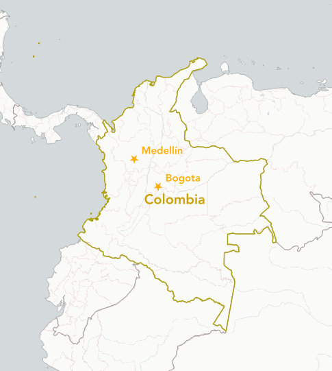
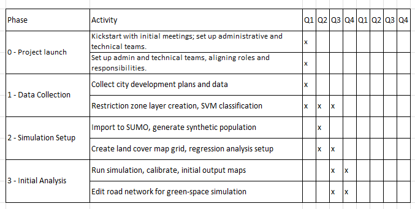
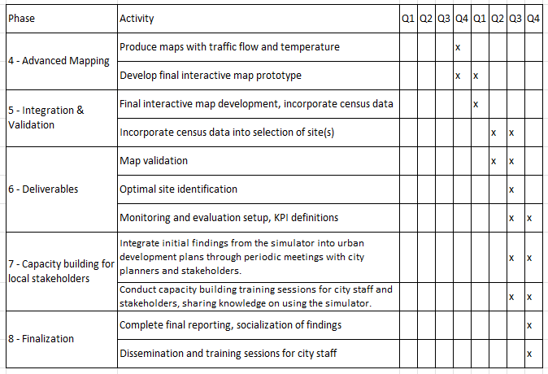
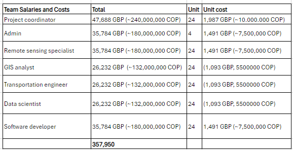
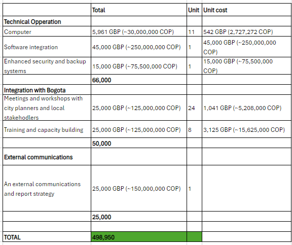

```{r setup, include=FALSE,echo=FALSE}
options(htmltools.dir.version = FALSE)
library(dplyr)
library(readr)
library(readxl)
library(knitr)
```

```{r xaringan-themer, include=FALSE, warning=FALSE}
library(xaringanthemer)
style_duo_accent(primary_color = "#0D5E74", 
                 # secondary_color = "#2881C6",
  header_font_google = google_font("Helvetica"),
  text_font_google   = google_font("Helvetica", "300", "300i"),
  code_font_google   = google_font("Helvetica"),
)
```

```{r xaringan-all, echo=FALSE, warning=FALSE}
library(countdown)
library(xaringan)
library(xaringanExtra)
hook_source <- knitr::knit_hooks$get('source')
knitr::knit_hooks$set(source = function(x, options) {
  x <- stringr::str_replace(x, "^[[:blank:]]?([^*].+?)[[:blank:]]*#<<[[:blank:]]*$", "*\\1")
  hook_source(x, options)
})
xaringanExtra::use_broadcast()
xaringanExtra::use_freezeframe()
xaringanExtra::use_scribble()
#xaringanExtra::use_slide_tone()
xaringanExtra::use_search(show_icon = TRUE, auto_search	=FALSE)
xaringanExtra::use_freezeframe()
xaringanExtra::use_clipboard()
xaringanExtra::use_tile_view()
xaringanExtra::use_panelset()
xaringanExtra::use_editable(expires = 1)
xaringanExtra::use_fit_screen()
xaringanExtra::use_extra_styles(
  hover_code_line = TRUE,         
  mute_unhighlighted_code = TRUE  
)
```

class: center, title-slide, middle

background-image: url("bogotathings1.jpeg")
background-size: cover
background-position: center

# Green Corridor in Bogotá
## CASA0023 Remotely Sensing Cities and Environments
### <br/>Ana Steiner, Aida Kazlauskaitė,<br/> Ciara Clarke, Marta Woroniecka and Hannah Schuller<br/>  `r format(Sys.time(), "%d/%m/%Y")`

---
## Table of contents

1. Bogota: the context
2. Past interventions
3. Our proposal
4. International and national compliance
5. Case study
6. Workflow: Simulation
7. Workflow: Site selection
8. Data inputs
9. Integration to Bogota's pipeline
10. Stakeholder engagement
11. Team roles and purposes
12. GANTT graph
13. Budget 
14. Limitations and mitigation of risk
15. Future continuation

---
## Bogota: the context 

.pull-left[Once celebrated for the world’s longest cycle route and the innovative Transmilenio system, Bogotá now faces several key challenges, including:

```{r echo=FALSE, out.width= "100%", fig.show='hold', fig.align= 'left'}

knitr::include_graphics('bogota.png')
```
]

.pull-right[
```{r echo=FALSE, out.width= "65%", fig.show='hold', fig.align= 'center'}

knitr::include_graphics('context.png')
```
]
---
## Past interventions
.pull-left[
```{r  echo=FALSE, out.width='90%', fig.align='left', cache=FALSE}

```
]

.pull-right[ 
##### (i) Medellin’s implemented Corredor Verde 
- Missed opportunities for continuous monitoring using remote sensing data
- Failed to fully utilise traffic congestion data
- Limited socio-demographic analysis
- Overlooked the urban heat island effect

##### (ii) Bogotá’s rejected Septima Verde
- Rejected due to skepticism of sustainability claims 
- Lack of EO data demonstrating environmental benefits
- No predictive modelling to anticipate traffic impacts
]

---
## Proposal

#### Main Objective:
- Develop a simulator using land surface temperature data and traffic data to identify optimal locations for a green corridor in Bogota.
- Account for how this will affect city-wide traffic flow and heat patterns before implementation.

#### Secondary Objectives:
- Transform key streets and corridors to prioritize greenery, public spaces, and pedestrian access. 
- Improve air quality by decreasing traffic congestion.

#### Outputs:
- A comprehensive simulator tool for planning green corridors.
- Capacity building programs for stakeholders to leverage the simulator in urban planning.
- A detailed proposal for the green corridor's location and design based on simulator outcomes.

---
## International and national compliance

```{r echo=FALSE, out.width= "70%", fig.show='hold', fig.align= 'centre'}


```

---
## Case study

### Cooling Singapore 2.0 – Digital Urban Climate Twin (DUCT)

.pull-left[
<small>
- Aims to simulate scenarios in regions experiencing elevated temperatures, which may involve the incorporation of additional parks and open spaces.
- A beta version of DUCT was released for testing by urban planners and policy makers.
- Integrates all pertinent computational models to consider environmental variables such as wind and sunlight, land cover, traffic, industrial and building energy models, and human mobility + allows for the simulation of various scenarios.
- Target is to achieve Technology Readiness Level 6+ by August 2024.

Sources: World Bank, 2023; Ang, 2024; Aydt, 2023.</small>]

.pull-right[
```{r echo=FALSE, out.width= "70%", fig.show='hold', fig.align= 'center'}

knitr::include_graphics('singapore.png')
```
]

---

```{r echo=FALSE, out.width= "90%", fig.show='hold', fig.align= 'centre'}

knitr::include_graphics('simulator_workflow.png')
```

---
```{r echo=FALSE, out.width= "70%", fig.show='hold', fig.align= 'centre'}


```

---
## Data inputs
.panelset[
.panel[.panel-name[Traffic]

```{r, echo=FALSE, message= FALSE, warning=FALSE}
library(readxl)
traffic <- read_excel('traffic.xlsx')
library(tidyverse) 
```

```{r, echo=FALSE}
knitr::kable(head(traffic), format = 'html')
```
]

.panel[.panel-name[Land surface temperature]
```{r, echo=FALSE, message= FALSE, warning=FALSE}
library(readxl)
LST <- read_excel('LST.xlsx')
library(tidyverse) 
```

```{r, echo=FALSE}
knitr::kable(head(LST), format = 'html')
```
]

.panel[.panel-name[Socio-demographic]
```{r, echo=FALSE, message= FALSE, warning=FALSE}
library(readxl)
sociodemographic <- read_excel('sociodemographic.xlsx')
library(tidyverse) 
```

```{r, echo=FALSE}
knitr::kable(head(sociodemographic), format = 'html')
```
]
]

---
## Integration to Bogota's pipeline

.pull-left[ 

#### Data integration: baseline and recollection for simulator

- **Environmental Monitoring Systems:** Align temperature data with SINA standards and implement automated APIs.
- **Traffic Data Integration:** Work with SIMUR to integrate real-time traffic data.

#### During the creation of the simulator and its respective capacity building

- **Urban Planning Software Compatibility:** Ensure simulator outputs are compatible with Bogotá's POT.
- **Training and Capacity Building:** Develop training for city staff on integrating simulator data.

]

.pull-right[ 

#### Collaborative decision making for choosing the site

- **Integration into Strategic Planning Sessions:** Include simulator insights in planning sessions.
- **Policy Impact Assessments:** Use simulator data for impact assessments of urban projects.

#### External communication and public engagement

- **Digital Engagement Platforms:** Use "Bogotá Abierta" to share findings and gather feedback.
- **Community Workshops and Forums:** Organize workshops with JACs in high-impact neighborhoods.
]

---
## Stakeholder engagement
.panelset[
.panel[.panel-name[Government agencies]
```{r echo=FALSE, out.width= "10%", fig.show='hold', fig.align= 'left'}


```
- District Planning Secretariat (Secretaría Distrital de Planeación)
- Environmental Secretariat (Secretaría Distrital de Ambiente)
- Mobility Secretariat (Secretaría de Movilidad)
- Department of Public Works (IDU - Instituto de Desarrollo Urbano)
]

.panel[.panel-name[Community organisations]
```{r echo=FALSE, out.width= "10%", fig.show='hold', fig.align= 'left'}

knitr::include_graphics('communities.png')
```
- Local Community Action Boards (Juntas de Acción Comunal)
- Bogotá Como Vamos
- Fundación Al Verde Vivo
]

.panel[.panel-name[Academia]
```{r echo=FALSE, out.width= "10%", fig.show='hold', fig.align= 'left'}

knitr::include_graphics('universities.png')
```
- Universidad de los Andes
- Universidad Nacional de Colombia
- Javeriana University
]

.panel[.panel-name[Commerce]
```{r echo=FALSE, out.width= "10%", fig.show='hold', fig.align= 'left'}

knitr::include_graphics('companies.png')
```
- Bogotá Chamber of Commerce (Cámara de Comercio de Bogotá):
- Fenalco Bogotá
]

.panel[.panel-name[Unions]
```{r echo=FALSE, out.width= "10%", fig.show='hold', fig.align= 'left'}

knitr::include_graphics('unions.png')
```
- Transportation Unions
- Residents of Affected Neighborhoods
]

.panel[.panel-name[Other]
```{r echo=FALSE, out.width= "10%", fig.show='hold', fig.align= 'left'}

knitr::include_graphics('organisations.png')
```
- Environmental Activist Groups
- World Bank Urban Development Sector
- C40 Cities Climate Leadership Group
]
]

---

## Team roles and purposes

| Team                    | Role/Purpose                                                                                                            |
|-------------------------|-------------------------------------------------------------------------------------------------------------------------|
| Project coordinator     | Oversee all project activities, ensuring milestones are met and align with the project's objectives. |
| Admin                   | Provide logistical, administrative, and operational support.                         |
| Remote sensing specialist | Expertise in acquiring and processing high-resolution optical imagery, NDVI, thermal infrared imagery, and air quality sensor data.  |
| GIS analyst             | Proficient in GIS software to integrate various data layers, perform spatial analysis, and produce maps and visualizations.  |
| Transportation engineer | Skilled in transport modeling and simulation, ideally with experience using SUMO (Simulation of Urban Mobility) or similar tools.  |
| Data scientist          | Capable of managing and analyzing large datasets, including journey origin-destination matrices and traffic flow data.  |
| Software developer      | To support the integration of simulation tools with GIS software, database systems, and potentially develop custom solutions for data analysis and visualization. |

---
## GANNT chart: Year 1

```{r echo=FALSE, out.width= "90%", fig.show='hold', fig.align= 'centre'}


```

---
## GANNT chart: Year 2

```{r echo=FALSE, out.width= "70%", fig.show='hold', fig.align= 'centre'}


```

---
## Budget (i)

```{r echo=FALSE, out.width= "80%", fig.show='hold', fig.align= 'centre'}


```

---
## Budget (ii)

```{r echo=FALSE, out.width= "60%", fig.show='hold', fig.align= 'centre'}


```

---
## Limitations and mitigation of risk

```{r echo=FALSE, out.width= "90%", fig.show='hold', fig.align= 'centre'}

knitr::include_graphics('limitations.png')
```

---
## Future continuation
- Retain use of the mapping tool for future green space implementations or road traffic adjustments
- Trained team of geo data analysts for tool implementation and future development
- Future iterations could predict other factors such as air quality by incorporating more data on building and vegetation height, meteorological data on wind speed and direction, and air quality recordings.

```{r echo=FALSE, out.width= "50%", fig.show='hold', fig.align= 'center', fig.cap= "Bogota Air Quality (Source: Breezometer, 2024)"}

knitr::include_graphics('airqualitymap.png')
```

---
## References (i)
Ang, J. (2024) Solving Singapore’s Urban Heat Island effect, Singapore Management University. Available at: https://research.smu.edu.sg/news/2024/feb/01/solving-singapore%E2%80%99s-urban-heat-island-effect#:~:text=About%20Digital%20Urban%20Climate%20Twin&text=The%20DUCT%20incorporates%20all%20relevant,as%20the%20movements%20of%20people (Accessed: 14 March 2024). 
 
Aydt, H (2023) ‘A Digital Urban Climate Twin of Singapore to Analyse Green Plan 2030 Scenarios’. Available at: https://www.mnd.gov.sg/docs/default-source/mnd-documents/uss-r-d-congress-2023-speaker-presentations/05-dr-heiko-aydt_a-digital-urban-climate-twin-of-singapore.pdf (Accessed: 14 March 2024). 
 

Breezometer (2024) Check the Air Quality in Bogota, Colombia. Available at: https://www.breezometer.com/air-quality-map/air-quality/colombia/bogota,-d.c. (Accessed: 14 March 2024) 
 

Gonzalez, P.A., Weinstein, J.S., Barbeau, S.J., Labrador, M.A., Winters, P.L., Georggi, N.L. and Perez, R., 2010. Automating mode detection for travel behaviour analysis by using global positioning systems-enabled mobile phones and neural networks. IET Intelligent Transport Systems, 4(1), pp.37-49. 

 
Hui, P. S. (2023) Cool solutions for a hotter climate: Tackling urban heat island effect with innovation, World Bank Blogs. Available at: https://blogs.worldbank.org/sustainablecities/cool-solutions-hotter-climate-tackling-urban-heat-island-effect-innovation (Accessed: 14 March 2024). 
 
---
## References (ii)
Imaginanet (2015) Bogota Traffic Management Interface. Available at: https://www.imaginanet.com/portfolio-en/bogota-en.html (Accessed: 14 March 2024). 

Onishi, A., Cao, X., Ito, T., Shi, F. and Imura, H., 2010. Evaluating the potential for urban heat-island mitigation by greening parking lots. Urban forestry & Urban greening, 9(4), pp.323-332. 

Prieto, A. (2022) Críticas al ‘corredor verde’ de la Carrera Séptima: denuncian que golpearía la movilidad, RCN Radio. RCN Radio. Available at: https://www.rcnradio.com/bogota/criticas-al-corredor-verde-de-la-carrera-septima-denuncian-que-golpearia-la-movilidad (Accessed: 14 March 2024). 
 
Rajah, I. (2023) 'Speech at the launch of Urban Lab Exhibition on ‘Shaping a Heat Resilient City’', 17 November. Available at: https://www.ura.gov.sg/uol/Corporate/Media-Room/Speeches/speech_Urban_Lab_Exb-Shaping_Heat_Resilient%20-City17Nov (Accessed: 14 March 2024). 
 
Reynoso, L. (2023) El corredor verde de la Séptima, proyecto insignia de Claudia López, naufraga en un juzgado, El País América Colombia. Available at: https://elpais.com/america-colombia/2023-10-26/el-corredor-verde-de-la-septima-proyecto-insignia-de-claudia-lopez-naufraga-en-un-juzgado.html# (Accessed: 14 March 2024). 

---
## References (iii)

Schweizer, J., Poliziani, C., Rupi, F., Morgano, D. and Magi, M. (2021) Building a large-scale micro-simulation transport scenario using big data. ISPRS International Journal of Geo-Information, 10(3), p.165. 
 
UN-Habitat (2003) Global Report on Human Settlements 2003, The Challenge of Slums, Earthscan, London; Part IV: 'Summary of City Case Studies', 'Bogota, Colombia', pp195-228. 

Vargas, C. C. (2023) Personería advierte que proyecto del Corredor Verde por la carrera 7ma está incompleto, Caracol Radio. Available at: https://caracol.com.co/2023/07/08/personeria-advierte-que-proyecto-del-corredor-verde-por-la-carrera-7ma-esta-incompleto/ (Accessed: 14 March 2024). 

Worldsensing (2015) BitCarrier - Traffic Flow Monitoring System By Worldsensing. Available at: https://www.environmental-expert.com/products/bitcarrier-traffic-flow-monitoring-system-719113 (Accessed: 14 March 2024). 
 
Zapata, G. O. (2019) Concejales critican improvisación en corredor verde de la Oriental, www.elcolombiano.com. ElColombiano.com. Available at: https://www.elcolombiano.com/antioquia/obras/concejo-de-medellin-lanza-duras-criticas-sobre-corredor-verde-de-la-oriental-JP11698212 (Accessed: 14 March 2024). 

Background image source: https://www.nomadicmatt.com/travel-blogs/things-to-see-and-do-in-bogota/  